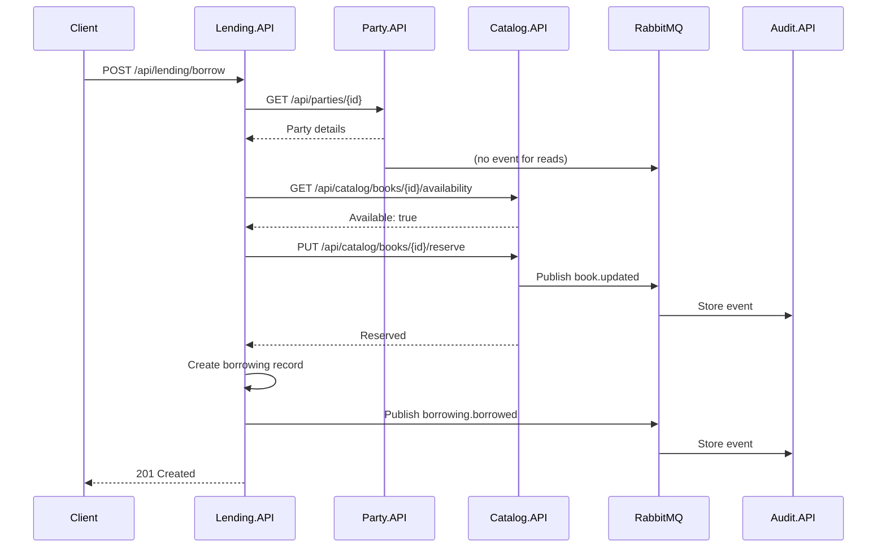
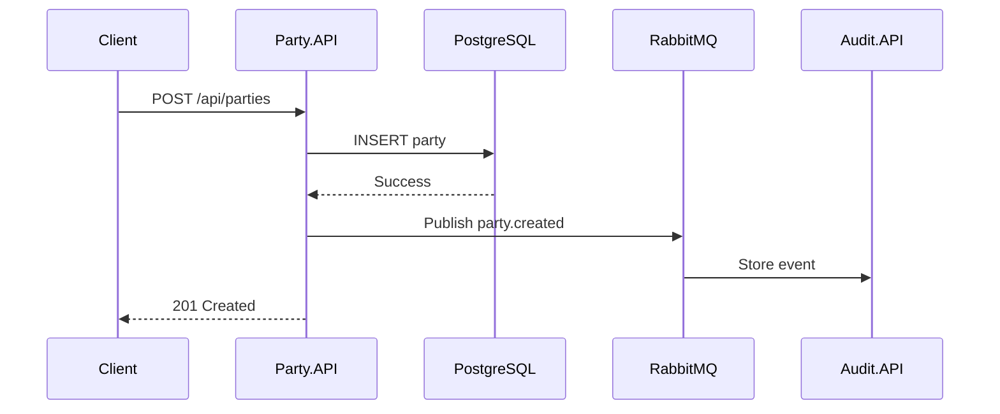

# Event-Driven Architecture

The Library Management System uses an event-driven architecture for loose coupling between services and to maintain a comprehensive audit trail.

## Overview

Events represent significant state changes in the system. They are:

- **Published** by services when domain events occur
- **Consumed** by Audit.API for audit trail storage
- **Asynchronous** - non-blocking fire-and-forget pattern

## Message Broker: RabbitMQ

RabbitMQ handles message routing between services.

### Configuration

- **Exchange**: `library.events` (topic exchange)
- **Host**: `rabbitmq` (Docker) or `localhost` (local)
- **Port**: 5672
- **Management UI**: http://localhost:15672 (guest/guest)

### Exchange Topology

```
library.events (topic exchange)
    ├── party.created → audit.queue
    ├── party.updated → audit.queue
    ├── party.role_assigned → audit.queue
    ├── party.role_removed → audit.queue
    ├── book.created → audit.queue
    ├── book.updated → audit.queue
    ├── book.deleted → audit.queue
    ├── borrowing.borrowed → audit.queue
    └── borrowing.returned → audit.queue
```

## Event Types

### Party Events

| Event | Routing Key | Publisher | Description |
|-------|-------------|-----------|-------------|
| PartyCreated | `party.created` | Party.API | New party registered |
| PartyUpdated | `party.updated` | Party.API | Party details changed |
| RoleAssigned | `party.role_assigned` | Party.API | Role added to party |
| RoleRemoved | `party.role_removed` | Party.API | Role removed from party |

**Payload Example:**
```json
{
  "PartyId": "550e8400-e29b-41d4-a716-446655440000",
  "Name": "John Doe",
  "Email": "john@example.com",
  "Timestamp": "2026-03-15T10:00:00Z"
}
```

### Catalog Events

| Event | Routing Key | Publisher | Description |
|-------|-------------|-----------|-------------|
| BookCreated | `book.created` | Catalog.API | New book added |
| BookUpdated | `book.updated` | Catalog.API | Book details changed |
| BookDeleted | `book.deleted` | Catalog.API | Book removed |

**Payload Example:**
```json
{
  "BookId": "550e8400-e29b-41d4-a716-446655440001",
  "Title": "The Great Gatsby",
  "Isbn": "978-0743273565",
  "AuthorId": "550e8400-e29b-41d4-a716-446655440000",
  "TotalCopies": 5,
  "Timestamp": "2026-03-15T10:05:00Z"
}
```

### Lending Events

| Event | Routing Key | Publisher | Description |
|-------|-------------|-----------|-------------|
| BookBorrowed | `borrowing.borrowed` | Lending.API | Book checked out |
| BookReturned | `borrowing.returned` | Lending.API | Book checked in |

**BookBorrowed Payload:**
```json
{
  "BorrowingId": "550e8400-e29b-41d4-a716-446655440002",
  "BookId": "550e8400-e29b-41d4-a716-446655440001",
  "BookTitle": "The Great Gatsby",
  "CustomerId": "550e8400-e29b-41d4-a716-446655440000",
  "CustomerName": "John Doe",
  "BorrowedAt": "2026-03-15T10:10:00Z",
  "DueDate": "2026-03-29T10:10:00Z"
}
```

**BookReturned Payload:**
```json
{
  "BorrowingId": "550e8400-e29b-41d4-a716-446655440002",
  "BookId": "550e8400-e29b-41d4-a716-446655440001",
  "CustomerId": "550e8400-e29b-41d4-a716-446655440000",
  "ReturnedAt": "2026-03-20T14:30:00Z"
}
```

## Event Publishing

### Implementation

Services publish events through an abstraction:

```csharp
public interface IEventPublisher {
    Task PublishAsync<T>(T @event, string routingKey) where T : class;
}

public class RabbitMqEventPublisher : IEventPublisher {
    // Implementation using RabbitMQ.Client
}
```

### Publishing Pattern

Events are published after successful database transactions:

```csharp
public async Task<Party> CreateAsync(CreatePartyRequest request) {
    // 1. Validate and create entity
    var party = new Party(request.Name, request.Email);
    await _repository.AddAsync(party);

    // 2. Save to database
    await _dbContext.SaveChangesAsync();

    // 3. Publish event
    var @event = new PartyCreatedEvent {
        PartyId = party.Id,
        Name = party.Name,
        Email = party.Email
    };
    await _eventPublisher.PublishAsync(@event, "party.created");

    return party;
}
```

## Event Consumption

### Audit.API Consumer

Audit.API uses a background service to consume events:

```csharp
public class RabbitMqEventConsumer : BackgroundService {
    protected override async Task ExecuteAsync(CancellationToken ct) {
        // Connect to RabbitMQ
        // Create queue and bind to exchange with "#" wildcard
        // Consume messages and store in MongoDB
    }
}
```

### Wildcard Binding

Audit.API binds to all events using a wildcard:

```csharp
// Binds to all routing keys
channel.QueueBind(
    queue: "audit.queue",
    exchange: "library.events",
    routingKey: "#"
);
```

This ensures Audit.API receives every event published to the exchange.

## Event Flow Examples

### Complete Borrow Flow



### Party Creation Flow



## Error Handling

### Publisher Side

- Events published after successful DB commit
- If publish fails, operation succeeds but event is lost (acceptable for audit)
- Could be enhanced with outbox pattern for guaranteed delivery

### Consumer Side

- Messages acknowledged after successful storage
- Failed messages are requeued (with retry limit)
- Dead letter queue for poison messages

## Monitoring

### RabbitMQ Management UI

Access at http://localhost:15672 (guest/guest):

- **Connections**: Active service connections
- **Channels**: Communication channels
- **Exchanges**: Message routing topology
- **Queues**: Message backlog and rates
- **Bindings**: Routing rules

### Key Metrics

| Metric | Description |
|--------|-------------|
| Publish Rate | Events published per second |
| Consume Rate | Events consumed per second |
| Queue Depth | Unprocessed messages |
| Connection Count | Active service connections |

## Design Decisions

### Why RabbitMQ?

- **Mature and reliable**: Battle-tested message broker
- **Topic exchanges**: Flexible routing with wildcards
- **Management UI**: Built-in monitoring
- **Docker support**: Official images with health checks

### Why Events for Audit Only?

Events are currently only consumed by Audit.API because:

1. **Simplicity**: Avoids distributed transaction complexity
2. **Correctness**: HTTP calls provide immediate consistency where needed
3. **Requirements**: Current use cases don't need event sourcing

Future enhancements could use events for:
- Cache invalidation
- Read model updates
- Cross-service synchronization
- Notification triggers

## Best Practices

1. **Event schema versioning**: Add version field for backward compatibility
2. **Idempotency**: Consumers should handle duplicate events
3. **Event size**: Keep payloads small; include IDs, not full objects
4. **Timestamps**: Always include UTC timestamps
5. **Correlation IDs**: Track requests across services
