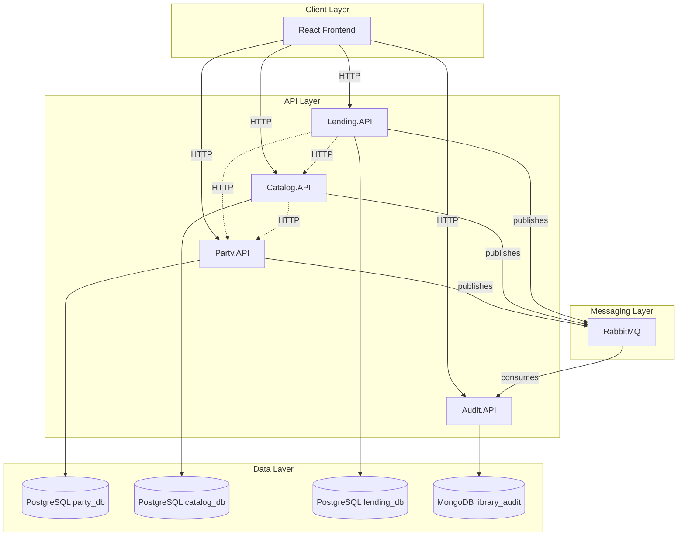
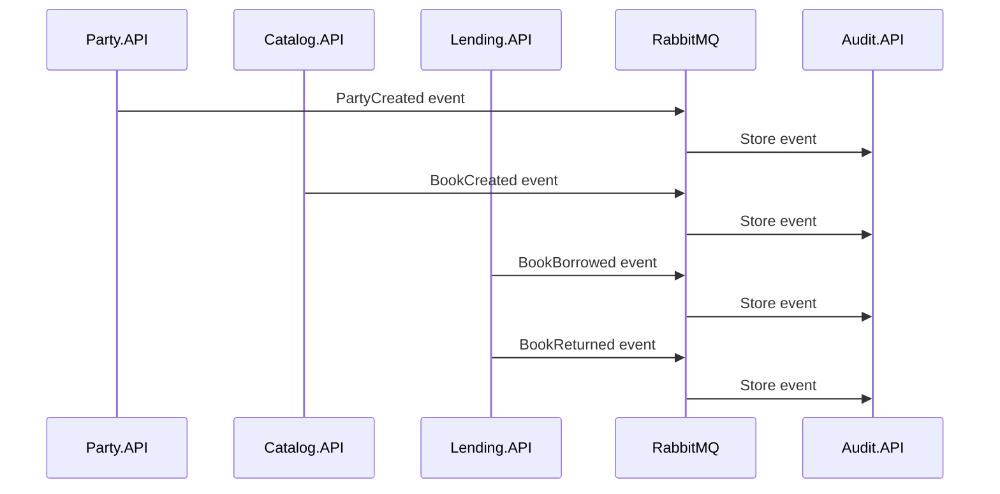

# Architecture Overview

The Library Management System is built using a microservices architecture with clear domain boundaries, event-driven communication, and polyglot persistence.

## Design Principles

1. **Domain-Driven Design** - Services align with business domains
2. **Database per Service** - Each service owns its data
3. **Event-Driven Communication** - Async messaging for cross-service updates
4. **CQRS** - Command/Query separation within services
5. **Resilience** - Retry and circuit breaker patterns for inter-service calls

## System Architecture

## Service Responsibilities

### Party.API

**Domain**: People and Roles

- Manage parties (people) with names and email addresses
- Assign/remove roles (Author, Customer)
- Validate customer identity for lending

**Dependencies**: None (Tier 1)

**Database**: PostgreSQL (party_db)

### Catalog.API

**Domain**: Books and Categories

- Manage book catalog with titles, ISBNs, authors
- Manage book categories
- Track available copies
- Validate authors via Party.API

**Dependencies**: Party.API (Tier 2)

**Database**: PostgreSQL (catalog_db)

### Lending.API

**Domain**: Borrowing and Returns

- Orchestrate book borrowing flow
- Process book returns
- Track active borrowings
- Provide borrowing summaries

**Dependencies**: Party.API, Catalog.API (Tier 3)

**Database**: PostgreSQL (lending_db)

### Audit.API

**Domain**: Event Store and Audit Trail

- Consume events from all services
- Store events in MongoDB
- Provide event query endpoints
- Event retention management

**Dependencies**: None (Tier 1, event consumer)

**Database**: MongoDB (library_audit)

## Communication Patterns

### Synchronous (HTTP)

Used for immediate data needs within request/response cycles:

- Lending.API → Party.API (validate customer)
- Lending.API → Catalog.API (check availability, reserve book)
- Catalog.API → Party.API (validate author)

**Resilience**: All HTTP calls use Polly for retry (3 attempts) and circuit breaker (5 failures, 30s recovery).

### Asynchronous (Events)

Used for state change notifications and audit trail:

## Data Consistency

### Strong Consistency

- Within a service's database (ACID transactions)
- Synchronous HTTP calls for critical validations

### Eventual Consistency

- Cross-service data via events (audit trail)
- Denormalized data (names copied at write time)

## Service Tiers

Services are organized into startup tiers based on dependencies:

| Tier | Services | Dependencies |
|------|----------|--------------|
| 1 | Party.API, Audit.API | Infrastructure only |
| 2 | Catalog.API | Party.API |
| 3 | Lending.API | Party.API, Catalog.API |

## Technology Stack

| Layer | Technology |
|-------|------------|
| APIs | .NET 10 |
| Relational DB | PostgreSQL 16 |
| Document DB | MongoDB 7 |
| Message Broker | RabbitMQ 3 |
| ORM | Entity Framework Core |
| Validation | FluentValidation |
| Resilience | Polly |
| Frontend | React 19 + Vite |

## Learn More

- [Services](services.md) - Detailed service documentation
- [Event-Driven Architecture](event-driven.md) - Events and messaging
- [Database Design](database.md) - Data persistence strategy
