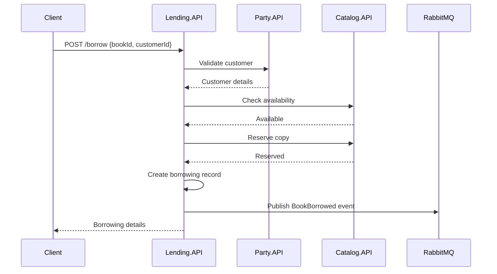
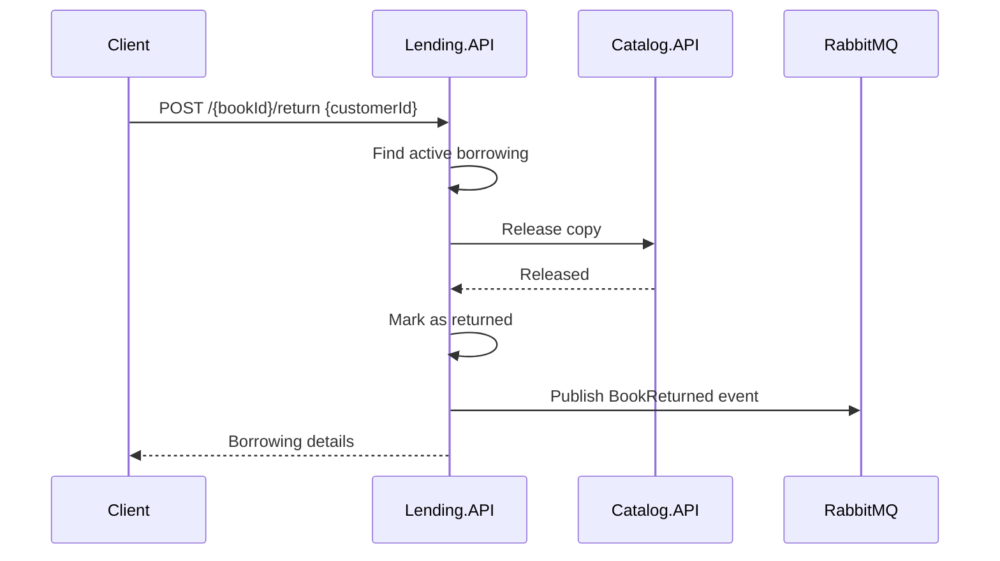

# Services

Detailed documentation for each microservice in the Library Management System.

## Party.API

**Port**: 5100

**Purpose**: Manages parties (people) and their roles in the library system.

### Domain Model

```csharp
public class Party {
    public Guid Id { get; set; }
    public string Name { get; set; }
    public string Email { get; set; }
    public List<Role> Roles { get; set; }
}

public class Role {
    public RoleType Type { get; set; } // Author, Customer
}
```

### API Endpoints

| Method | Endpoint | Description |
|--------|----------|-------------|
| GET | `/api/parties` | List all parties |
| GET | `/api/parties/{id}` | Get party by ID |
| POST | `/api/parties` | Create new party |
| PUT | `/api/parties/{id}` | Update party |
| DELETE | `/api/parties/{id}` | Delete party |
| POST | `/api/parties/{id}/roles` | Assign role to party |
| DELETE | `/api/parties/{id}/roles/{roleType}` | Remove role from party |

### Events Published

| Event | Routing Key | Description |
|-------|-------------|-------------|
| PartyCreated | `party.created` | New party registered |
| PartyUpdated | `party.updated` | Party details changed |
| RoleAssigned | `party.role_assigned` | Role added to party |
| RoleRemoved | `party.role_removed` | Role removed from party |

### Key Business Rules

- A party can have multiple roles (Author AND Customer)
- Email addresses must be unique
- Names cannot be empty

---

## Catalog.API

**Port**: 5200

**Purpose**: Manages the book catalog and categories.

### Domain Model

```csharp
public class Book {
    public Guid Id { get; set; }
    public string Title { get; set; }
    public string Isbn { get; set; }
    public Guid AuthorId { get; set; }
    public string AuthorName { get; set; } // Denormalized
    public Guid CategoryId { get; set; }
    public int TotalCopies { get; set; }
    public int AvailableCopies { get; set; }
}

public class Category {
    public Guid Id { get; set; }
    public string Name { get; set; }
    public string Description { get; set; }
}
```

### API Endpoints

| Method | Endpoint | Description |
|--------|----------|-------------|
| GET | `/api/catalog/books` | List all books |
| GET | `/api/catalog/books/{id}` | Get book by ID |
| GET | `/api/catalog/books/search?title={title}` | Search books by title |
| GET | `/api/catalog/books/{id}/availability` | Check book availability |
| POST | `/api/catalog/books` | Create new book |
| PUT | `/api/catalog/books/{id}` | Update book |
| DELETE | `/api/catalog/books/{id}` | Delete book |
| PUT | `/api/catalog/books/{id}/reserve` | Reserve a copy (internal) |
| PUT | `/api/catalog/books/{id}/release` | Release a copy (internal) |
| GET | `/api/catalog/categories` | List all categories |
| GET | `/api/catalog/categories/{id}` | Get category by ID |
| POST | `/api/catalog/categories` | Create category |
| PUT | `/api/catalog/categories/{id}` | Update category |
| DELETE | `/api/catalog/categories/{id}` | Delete category |

### Events Published

| Event | Routing Key | Description |
|-------|-------------|-------------|
| BookCreated | `book.created` | New book added |
| BookUpdated | `book.updated` | Book details changed |
| BookDeleted | `book.deleted` | Book removed |

### External Dependencies

- **Party.API**: Validates author ID exists and has Author role

### Key Business Rules

- ISBN must be unique
- Author must exist in Party.API with Author role
- AvailableCopies cannot exceed TotalCopies
- AvailableCopies cannot be negative

---

## Lending.API

**Port**: 5300

**Purpose**: Orchestrates book borrowing and return workflows.

### Domain Model

```csharp
public class Borrowing {
    public Guid Id { get; set; }
    public Guid BookId { get; set; }
    public string BookTitle { get; set; } // Denormalized
    public Guid CustomerId { get; set; }
    public string CustomerName { get; set; } // Denormalized
    public DateTime BorrowedAt { get; set; }
    public DateTime DueDate { get; set; }
    public DateTime? ReturnedAt { get; set; }
    public BorrowingStatus Status { get; set; }
}

public enum BorrowingStatus {
    Active,
    Returned,
    Overdue
}
```

### API Endpoints

| Method | Endpoint | Description |
|--------|----------|-------------|
| POST | `/api/lending/borrow` | Borrow a book |
| POST | `/api/lending/{bookId}/return` | Return a book |
| GET | `/api/lending/summary` | Get borrowed books summary |
| GET | `/api/lending/{id}` | Get borrowing by ID |
| GET | `/api/lending/by-customer/{customerId}` | Get customer's borrowings |
| GET | `/api/lending/by-book/{bookId}` | Get book's borrowings |

### Request/Response Examples

**Borrow Book:**
```json
POST /api/lending/borrow
{
  "bookId": "550e8400-e29b-41d4-a716-446655440000",
  "customerId": "550e8400-e29b-41d4-a716-446655440001"
}
```

**Return Book:**
```json
POST /api/lending/{bookId}/return
{
  "customerId": "550e8400-e29b-41d4-a716-446655440001"
}
```

### Events Published

| Event | Routing Key | Description |
|-------|-------------|-------------|
| BookBorrowed | `borrowing.borrowed` | Book checked out |
| BookReturned | `borrowing.returned` | Book checked in |

### External Dependencies

- **Party.API**: Validates customer exists and has Customer role
- **Catalog.API**: Checks availability, reserves/releases copies

### Borrow Flow



### Return Flow



### Key Business Rules

- Customer must have Customer role
- Book must have available copies
- Customer cannot borrow same book twice simultaneously
- Due date is 14 days from borrow date

---

## Audit.API

**Port**: 5400

**Purpose**: Event store and audit trail for all system activities.

### Domain Model

```csharp
public class Event {
    public string Id { get; set; }
    public string EventType { get; set; }
    public string EntityType { get; set; }
    public string EntityId { get; set; }
    public DateTime Timestamp { get; set; }
    public Dictionary<string, object> Payload { get; set; }
}
```

### API Endpoints

| Method | Endpoint | Description |
|--------|----------|-------------|
| GET | `/api/events` | List all events (paginated, filterable) |
| GET | `/api/events/parties/{partyId}` | Events for specific party |
| GET | `/api/events/books/{bookId}` | Events for specific book |

### Query Parameters

**GET /api/events** supports filtering:

| Parameter | Type | Description |
|-----------|------|-------------|
| entityType | string | Filter by entity type (Party, Book, Borrowing) |
| action | string | Filter by action (Created, Updated, Borrowed, etc.) |
| entityId | string | Filter by specific entity ID |
| from | datetime | Start date range |
| to | datetime | End date range |
| page | int | Page number (default: 1) |
| pageSize | int | Items per page (default: 20, max: 100) |

### Event Consumption

Audit.API consumes all events from RabbitMQ using a wildcard binding (`#`):

```csharp
// Binds to all routing keys
channel.QueueBind(queue, exchange, routingKey: "#");
```

### Event Retention

Events are automatically deleted after 90 days using:

1. **MongoDB TTL Index** - Automatic expiration
2. **Background Service** - Daily cleanup job for guaranteed removal

### Data Structure

Events are stored as documents in MongoDB:

```json
{
  "_id": "...",
  "EventType": "BookBorrowed",
  "EntityType": "Borrowing",
  "EntityId": "550e8400-e29b-41d4-a716-446655440000",
  "Timestamp": "2026-03-15T10:30:00Z",
  "Payload": {
    "BookId": "...",
    "CustomerId": "...",
    "DueDate": "..."
  },
  "ExpireAt": "2026-06-13T10:30:00Z"
}
```

## Service Comparison

| Aspect | Party.API | Catalog.API | Lending.API | Audit.API |
|--------|-----------|-------------|-------------|-----------|
| **Port** | 5100 | 5200 | 5300 | 5400 |
| **Database** | PostgreSQL | PostgreSQL | PostgreSQL | MongoDB |
| **Tier** | 1 | 2 | 3 | 1 |
| **Publishes Events** | Yes | Yes | Yes | No |
| **Consumes Events** | No | No | No | Yes |
| **HTTP Clients** | No | Yes | Yes | No |
