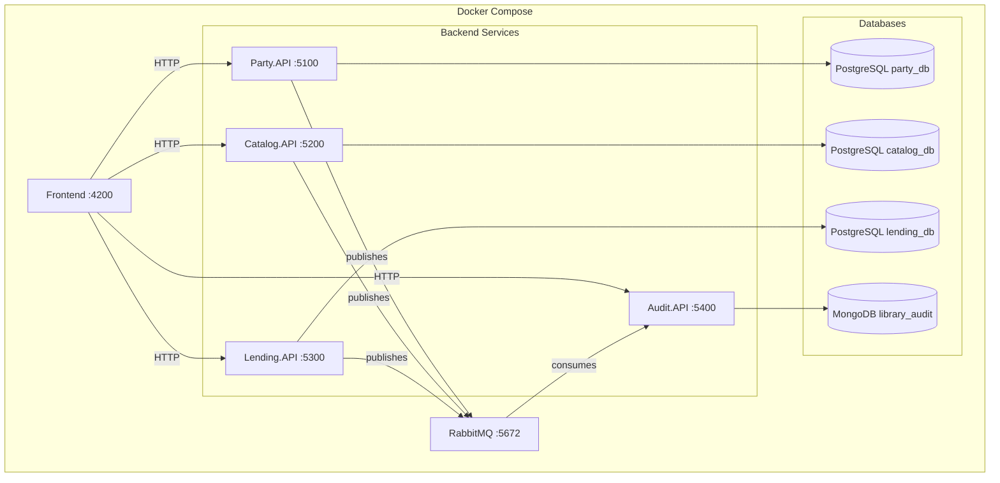

# Library Management System

Welcome to the Library Management System documentation. This is a microservices-based application built with modern .NET technologies, designed to manage library operations including parties (members), book cataloging, and lending workflows.

## Overview

The Library Management System is a distributed application composed of four microservices, each responsible for a specific domain:

- **Party.API** - Manages people and their roles (authors, customers)
- **Catalog.API** - Manages books and categories
- **Lending.API** - Orchestrates book borrowing and returns
- **Audit.API** - Event store for tracking all system activities

## Quick Links

<div class="grid cards" markdown>

-   :material-rocket-launch: __Getting Started__

    ---

    Set up the project locally or with Docker

    [:octicons-arrow-right-24: Setup Guide](setup/index.md)

-   :material-diagram: __Architecture__

    ---

    Learn about the microservices architecture and design decisions

    [:octicons-arrow-right-24: Architecture Overview](architecture/index.md)

-   :material-api: __API Reference__

    ---

    Explore the REST API endpoints for each service

    [:octicons-arrow-right-24: API Documentation](api/index.md)

-   :material-book-open: __Assignment__

    ---

    View the original assignment requirements and implementation details

    [:octicons-arrow-right-24: Assignment Details](assignment/index.md)

</div>

## Technology Stack

| Component | Technology |
|-----------|------------|
| Backend | .NET 10 |
| Databases | PostgreSQL 16, MongoDB 7 |
| Message Broker | RabbitMQ 3 |
| Frontend | React 19 + Vite |
| ORM | Entity Framework Core |
| Validation | FluentValidation |
| Resilience | Polly |
| Testing | xUnit |

## Architecture at a Glance



## Service Ports

| Service | Port | Swagger URL |
|---------|------|-------------|
| Party.API | 5100 | http://localhost:5100/swagger |
| Catalog.API | 5200 | http://localhost:5200/swagger |
| Lending.API | 5300 | http://localhost:5300/swagger |
| Audit.API | 5400 | http://localhost:5400/swagger |
| RabbitMQ Management | 15672 | http://localhost:15672 |
| Frontend | 4200 | http://localhost:4200 |

## Getting Started

The fastest way to get started is using Docker Compose:

```bash
# Clone the repository
git clone <repository-url>
cd library-management

# Start all services
make up
```

For detailed setup instructions, see the [Setup Guide](setup/index.md).

## Development

### Running Tests

```bash
# Run all tests
make test

# Run specific service tests
dotnet test tests/Party.API.Tests/
dotnet test tests/Catalog.API.Tests/
dotnet test tests/Lending.API.Tests/
dotnet test tests/Audit.API.Tests/
```

### Smoke & E2E Tests

```bash
# Quick health check
make smoke

# Full end-to-end flow
make e2e
```

## License

This is a Vimachem interview assignment.
